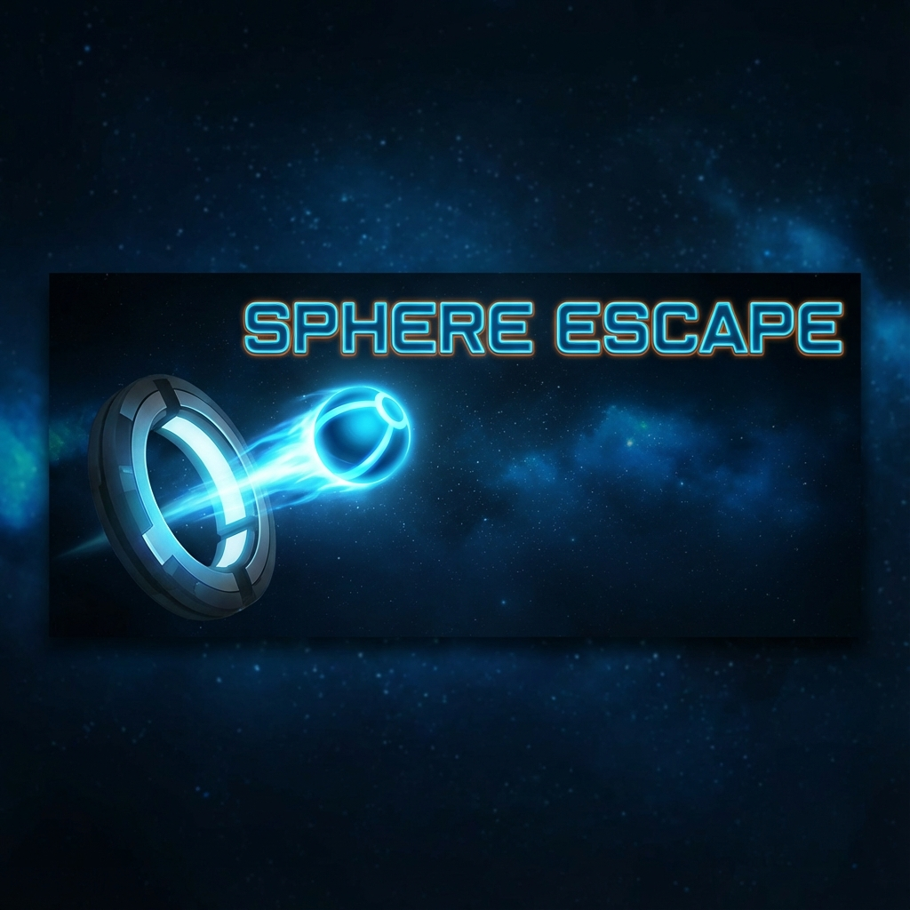

<div align="center">
  
</div>

<div align="center">
  <h1>Sphere Escape</h1>
  <p>Une expérience physique relaxante et hypnotique.</p>
</div>

## 🎮 À propos

**Sphere Escape** est une simulation physique interactive où le but est de faire échapper une sphère d'un conteneur rotatif. Chaque rebond accélère la rotation et change la couleur de la balle, créant un spectacle visuel dynamique et satisfaisant.

## ✨ Fonctionnalités

- **Physique Réaliste** : Gravité, friction et rebonds dynamiques.
- **Gameplay Émergent** : Le conteneur accélère à chaque interaction.
- **Design Visuel Soigné** : Effets de néon, traînées lumineuses et interface moderne.
- **Challenge Progressif** : Le système suit le nombre de tentatives nécessaires pour s'échapper.
- **Audio & Visuel** : Une expérience immersive (audio à venir).

## 🚀 Installation et Lancement

1. **Cloner le dépôt**
   ```bash
   git clone https://github.com/Cdsfr/sphere-multiplier.git
   cd sphere-multiplier
   ```

2. **Installer les dépendances**
   ```bash
   npm install
   ```

3. **Lancer le serveur de développement**
   ```bash
   npm run dev
   ```

4. **Ouvrir dans le navigateur**
   Ouvrez votre navigateur à l'adresse indiquée (généralement `http://localhost:5173`).

## 🕹️ Comment Jouer

1. Cliquez sur **"Démarrer"** pour lancer une nouvelle simulation.
2. Observez la balle rebondir et interagir avec l'ouverture du cercle.
3. Chaque fois que la balle touche le mur :
   - Elle change de couleur.
   - Le cercle tourne plus vite.
4. **But** : La balle doit passer par l'ouverture pour s'échapper !
5. Si le temps imparti est écoulé, la balle gèle et devient un obstacle pour la prochaine tentative.

## 🛠️ Stack Technique

- **Framework** : React + Vite
- **Langage** : TypeScript
- **Style** : Tailwind CSS
- **Rendu** : HTML5 Canvas API
- **Icônes** : Lucide React

## 📄 Licence

Ce projet est sous licence MIT. Libre à vous de le modifier et de le partager.
